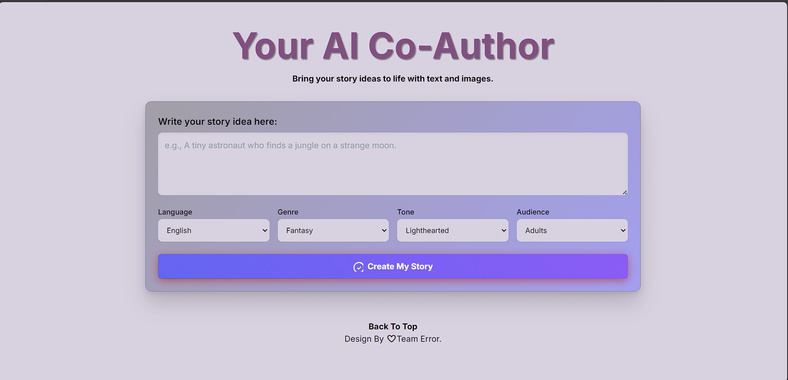

# Your AI Co-Author ✍️🤖

Your_AI-Co-Author is a web-based tool that helps generate AI-powered stories and creative content.  
It provides an easy-to-use interface where users can enter prompts and get instant AI-generated image with story.

## 🚀 Features
- AI-powered story generation  
- Simple and clean UI  
- Download option for generated stories  
- Responsive design  

## 📂 Project Structure
📦 Your-AI-Co-Author
 ┣ 📂 scripts
 ┣ 📂 styles
 ┣ 📜 index.html
 ┣ 📜 README.md

## 🛠️ Technologies Used
- HTML  
- CSS  
- JavaScript

## 🔧 How to Run
1. Clone the repo:
   \`\`\`bash
   git clone https://github.com/Vinaybgm/Your_AI-Co-Author.git
   \`\`\`
2. Open index.html in your browser.  

## 📸 Screenshots
### Home Page

 

## 📌 Future Improvements
- Add backend for saving stories  
- User authentication  
- More AI models support  

---

✨ Design by ❤️ Team Error" > README.md
